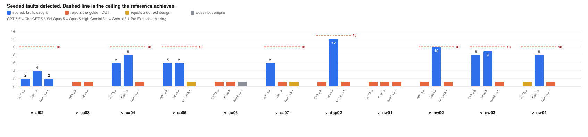

# HW-RL-Environments

A benchmark measuring whether language models can do two distinct jobs in RTL design:

1. **Design tasks**: write synthesisable SystemVerilog from a written specification, then be measured on correctness *and* on area, power and maximum frequency after a real place-and-route flow.
2. **Verification tasks**: write a self-checking testbench from a written specification, **never seeing the RTL**, then be measured on whether it accepts correct hardware and rejects faulty hardware.

The two are reported separately and never averaged. A testbench has no area; a design has no fault-detection rate. A single figure of merit would have to weight those against each other, and nothing here establishes those weights.

---

## Results at a glance

<picture>
  <source media="(prefers-color-scheme: dark)" srcset="docs/assets/funnel_dark.svg">
  
</picture>

**Most submissions do not reach a score, and they fail early.** Of 22 design
submissions, 6 never compile: most are rejected by the synthesis frontend
before simulation. 14 of the 16 that build are correct across every legal
configuration.

Of 30 verification submissions, 3 do not compile and a further 13
fail the validity gate, leaving 11 with a fault count. **That gate is the
binding constraint on this half.** A testbench that fails it returns the same
verdict on correct and broken hardware, and every one that does so here rejects
the correct design too, so it rejects everything and its fault count carries no
information.

Where a testbench does clear the gate it usually scores near the ceiling, so the
distribution is bimodal rather than centred on a middling value. Where PPA
exists, the gap to the reference is large and not uniform: on the CDC FIFO the
submissions are 26 to 29 % smaller at the same clock, trading frequency for area,
while on the AXI crossbar the one measured submission is 14.2× the reference's
area and slower.

<picture>
  <source media="(prefers-color-scheme: dark)" srcset="docs/assets/verification_faults_dark.svg">
  
</picture>

---

## Design results

One table per task. Correctness is every legal parameter combination the task
defines. Area and power are post-route at one clock period every design in the
row closes; a design that misses timing has no reportable area (rule 22), and an
unmeasured cell is left blank rather than filled (rule 20).

*PPA for d_ca01, d_dsp03, d_nw03 and the `claude` submissions is measuring now
and lands blank until it completes. d_dsp02 is withheld entirely: its
specification was revised, so every submission answers a superseded prompt until
re-run.*

### d_ca04: asynchronous CDC FIFO

Built at **4.5 ns**, the slowest own-Fmax among the measured designs, so all close there.

| Submission | Correctness | Area (µm²) | Power (mW) | Own Fmax (MHz) | Capacity (beats) | Area per beat |
|---|---|---|---|---|---|---|
| reference | 18/18 | 19,887 | 12.90 | 380.9 | **10** | 1,989 |
| ChatGPT 5.6 Sol | 18/18 | 14,685 | 7.30 | 222.2 | 8 | 1,836 |
| DeepSeek V4 Pro | 18/18 | 14,589 | 7.45 | 273.5 | 8 | 1,824 |
| Gemini 3.1 Pro | 18/18 | 14,515 | 7.12 | 273.5 | 8 | 1,814 |
| Qwen 3.7 Plus | 18/18 | **14,176** | 7.85 | 273.5 | 8 | **1,772** |
| Claude Opus 5 | 18/18 | | | | 8 | |

Five of five correct and 26 to 29 % below the reference on raw area, **but 9 to
11 % below it per beat of FIFO capacity**: the reference accepts 10 beats where
every submission accepts 8, and most of the headline gap is those two extra
beats rather than a better implementation. Both columns are shown because
neither alone is honest, and per-beat mildly flatters the larger design since
control logic is roughly fixed. Cell-count evidence is in
[NOTES.md](domains/comp_arch/design/d_ca04_async_fifo_cdc/NOTES.md).

### d_nw01: AXI4 crossbar

Built at **9.0 ns**, the submission's own maximum and the slower of the two.

| Submission | Correctness | Area (µm²) | Power (mW) | Own Fmax (MHz) |
|---|---|---|---|---|
| reference | 16/16 | 146,932 | 48.60 | 190.5 |
| ChatGPT 5.6 Sol | 16/16 | 2,086,235 | 448.00 | 111.1 |
| Claude Opus 5 | 16/16 | | | |
| DeepSeek V4 Pro | rejected by slang | | | |
| Gemini 3.1 Pro | rejected by slang | | | |
| Qwen 3.7 Plus | rejected by slang | | | |

Three of five never reach measurement. **The 14.2× area gap has a single cause
and it is not implementation quality:** the submission buffers a full 256-beat
burst per master, about 20,480 bits of flip-flops, where the reference holds two
beats in a spill register. It was a conforming answer, because the specification
bounded what the crossbar must achieve and never bounded what it could spend
achieving it. Clause C3 now caps in-crossbar storage at 4 beats per master port,
and these submissions predate it.

Outstanding-transaction capacity is in
[NOTES.md](domains/networking/design/d_nw01_axi4_xbar/NOTES.md); the reference
never saturates within the stimulus, so it has a lower bound, not a figure.

### d_ca01: non-blocking data cache

Reference closes at **10.0 ns (100.0 MHz)**, WNS +0.04 ns. It misses 9.375 ns by 0.07 ns.

| Submission | Correctness | Area (µm²) | Power (mW) | Own Fmax (MHz) | Outstanding misses |
|---|---|---|---|---|---|
| reference | 16/16 | | | 100.0 | |
| ChatGPT 5.6 Sol | 16/16 | 753,209 | 440.0 | | 9 |
| Claude Opus 5 | 16/16 | | | | **16** |
| Gemini 3.1 Pro | 8/16, a load returns the wrong value | | | | 9 |

**Claude Opus 5 tracks 16 outstanding misses where ChatGPT tracks 9.** That is a
design choice the specification leaves free, and it should cost area, so the
area comparison between those two is not like-for-like until both are built.

The largest design here, and the only task whose mutants carry bounded formal
counterexamples rather than simulation witnesses.

### d_nw03: output-queued AXI-Stream switch

| Submission | Correctness | Area (µm²) | Power (mW) | Own Fmax (MHz) |
|---|---|---|---|---|
| ChatGPT 5.6 Sol | 8/8 | | | |
| Claude Opus 5 | 8/8 | | | |
| Gemini 3.1 Pro | 8/8 | | | |

All three pass everything. **This task does not discriminate on correctness** and
needs harder configurations or more mutants before that column carries
information. Its PPA is measuring now, which is the only axis on which it can
currently separate anything.

### d_dsp03: multi-format FMA

| Submission | Correctness | Area (µm²) | Power (mW) | Own Fmax (MHz) |
|---|---|---|---|---|
| ChatGPT 5.6 Sol | 2/2 | | | |
| Claude Opus 5 | 0/2, wrong flags at vector 6300 | | | |
| Gemini 3.1 Pro | rejected by slang | | | |

### d_dsp02: FP32 fused multiply-add

**Withheld.** The specification was revised to pin the underflow convention
longhand, moving the task text from `5ad30593403b4ae2` to `13e3c4673f8a3270`. All
five submissions were scored against the old text, so their verdicts stand but
none is currently reportable. They are being re-run.

Previously measured at 20.25 ns: reference 59,890 µm², ChatGPT 360,899 µm², a 6.0×
ratio at the same clock. Those numbers are correct for the text they answered.

---

### How design choices are separated from implementation quality

Area is only comparable at a shared clock, and only between designs that made the
same free choices. Each design task declares its metrics with a role:

- **fixed** the specification requires a value; deviating is a spec violation.
- **choice** the specification leaves it free and it moves PPA. Where a
  submission chose differently from the reference, the report marks the area
  ratio **not like-for-like** rather than presenting it as a quality gap.
- **capability** more is better and area buys it. Reported raw and per unit,
  because raw area credits a design for being small when it was doing less.

There is deliberately no combined score. Nothing here establishes what a beat of
FIFO capacity is worth in µm².

---

## Verification results

One table per task. **Tells correct from broken** is the gate: every testbench
runs against the correct DUT and against one with every output tied high, and
must pass the first and fail the second. Returning the same verdict on both means
it is not observing the design, so its fault count is withheld rather than
printed. A file that drives nothing and prints `PASS` scores 0 here.

The ceiling is what each task's own reference testbench achieves, which proves
every seeded fault is findable.

### v_dsp02: FP non-computational ops (ceiling 10/10)

| Submission | Tells correct from broken | Faults caught |
|---|---|---|
| Claude Opus 5 | yes | **10/10** |
| ChatGPT 5.6 Sol | yes | **9/10** |
| DeepSeek V4 Pro | yes | 8/10 |
| Gemini 3.1 Pro | **no** | *withheld* |
| Qwen 3.7 Plus | did not compile | |

### v_nw03: frame-arbitrating stream mux (ceiling 10/10)

| Submission | Tells correct from broken | Faults caught |
|---|---|---|
| ChatGPT 5.6 Sol | yes | **9/10** |
| Claude Opus 5 | yes | **9/10** |
| DeepSeek V4 Pro | yes | 6/10 |
| Gemini 3.1 Pro | rejects a legal variant | *withheld* |
| Qwen 3.7 Plus | **no** | *withheld* |

### v_ca05: tag tracker (ceiling 10/10)

| Submission | Tells correct from broken | Faults caught |
|---|---|---|
| ChatGPT 5.6 Sol | yes | **9/10** |
| Claude Opus 5 | rejects a legal variant | *withheld* |
| Gemini 3.1 Pro | rejects a legal variant | *withheld* |
| DeepSeek V4 Pro | did not compile | |
| Qwen 3.7 Plus | did not compile | |

### v_nw04: PTP time base (ceiling 8/8)

| Submission | Tells correct from broken | Faults caught |
|---|---|---|
| Claude Opus 5 | yes | **8/8** |
| ChatGPT 5.6 Sol | **no** | *withheld* |
| Gemini 3.1 Pro | **no** | *withheld* |

### v_ca04: stream crossbar (ceiling 8/8)

| Submission | Tells correct from broken | Faults caught |
|---|---|---|
| Claude Opus 5 | yes | **8/8** |
| ChatGPT 5.6 Sol | yes | **7/8** |
| Gemini 3.1 Pro | **no** | *withheld* |

### v_ca03: AXI ID-width converter (ceiling 5/5)

| Submission | Tells correct from broken | Faults caught |
|---|---|---|
| Claude Opus 5 | yes | **4/5** |
| ChatGPT 5.6 Sol | **no** | *withheld* |
| Gemini 3.1 Pro | **no** | *withheld* |

### v_nw02: AXI atomic-op filter (ceiling 8/8)

| Submission | Tells correct from broken | Faults caught |
|---|---|---|
| ChatGPT 5.6 Sol | **no** | *withheld* |
| Claude Opus 5 | **no** | *withheld* |
| Gemini 3.1 Pro | **no** | *withheld* |

### v_ai02: byte-stream realignment (ceiling 8/8)

| Submission | Tells correct from broken | Faults caught |
|---|---|---|
| Claude Opus 5 | yes | **8/8** |
| ChatGPT 5.6 Sol | yes | **8/8** |
| Gemini 3.1 Pro | **no** | *withheld* |

Re-solicited after a specification defect was found and fixed. The earlier round
had all three submissions rejecting the golden DUT on clause P1, which claimed
the output strobe passes through in transparent mode; the anchor never does that,
and an independently written implementation always does, so the behaviour is now
recorded as latitude (L3) rather than required either way. Two of the three
submissions reach the ceiling against the corrected contract.

**The gate, not fault detection, is the binding constraint.** Roughly half of all
testbenches return the same verdict on correct and broken hardware, and every one
of those rejects the correct design as well: they reject everything. Three tasks,
v_nw02, v_ai02 and v_nw04 for two of three models, are failed by every submission
or nearly so. Where a testbench does clear the gate, it usually scores near the
ceiling, and Claude Opus 5 reaches it on three tasks.

---

## The tasks, and where this hardware is used

Reference for the results above. Thirteen tasks across three domains, every one anchored on a real, widely deployed open-source IP block rather than a toy. The reference implementation is vendored from upstream at a pinned commit, so "correct" means agreeing with hardware that people actually tape out.

### Computer architecture: the plumbing inside a CPU or SoC

| Task | Block | What it does | Where you find it | Upstream anchor |
|---|---|---|---|---|
| **d_ca04** *design* | Asynchronous CDC FIFO | Moves data between two unrelated clocks without corrupting it | Any chip with more than one clock, which is nearly all of them. The classic source of bugs that appear only in silicon | `pulp-platform/common_cells` |
| **v_ca05** *verification* | Tag tracker / ID queue | Tracks outstanding transactions so out-of-order responses can be matched to requests | Cache controllers, memory controllers, any out-of-order interconnect | `pulp-platform/common_cells` |
| **d_ca01** *design* | Non-blocking data cache | Serves hits while misses are still outstanding, instead of stalling until each fill returns | Every performance CPU. The difference between a core that stalls on every miss and one that keeps working | `bespoke-silicon-group/basejump_stl` |
| **v_ca03** *verification* | AXI ID-width converter | Remaps wide master IDs onto a narrower slave ID space without breaking ordering | Any SoC joining subsystems whose ID widths disagree, which is most of them | `pulp-platform/axi` |
| **v_ca04** *verification* | Stream crossbar | Routes N stream inputs to M outputs with per-output arbitration | On-chip switch fabric, DMA engines, any many-to-many datapath | `pulp-platform/common_cells` |

### DSP: floating-point arithmetic

| Task | Block | What it does | Where you find it | Upstream anchor |
|---|---|---|---|---|
| **d_dsp02** *design* | FP32 fused multiply-add | Computes `a×b+c` in one rounding step, one result per cycle | The core operation of every ML accelerator and GPU shader; the bulk of the silicon in a matrix engine | `pulp-platform/cvfpu` |
| **v_dsp02** *verification* | FP non-computational ops | Sign manipulation, comparison, min/max, classification: the IEEE-754 operations that move bits rather than compute | Every FPU. Individually simple, collectively full of edge cases: NaN, signed zero, subnormals | `pulp-platform/cvfpu` |
| **d_dsp03** *design* | Multi-format FMA | One multiply-add datapath serving several floating-point widths | Mixed-precision ML accelerators, where fp32 and bf16 share hardware | `pulp-platform/cvfpu` |

### Networking: on-chip interconnect

| Task | Block | What it does | Where you find it | Upstream anchor |
|---|---|---|---|---|
| **d_nw01** *design* | AXI4 crossbar | Routes transactions between several masters and several slaves, keeping AXI's ordering rules | The backbone of essentially every ARM-based SoC | `pulp-platform/axi` |
| **v_nw03** *verification* | Frame-arbitrating stream mux | Merges several AXI-Stream inputs into one without interleaving packets | NIC datapaths, video pipelines, anything moving framed data | `alexforencich/verilog-axis` |
| **d_nw03** *design* | Output-queued stream switch | Switches AXI-Stream traffic with per-output queueing | Ethernet switch fabrics, NoC routers | `alexforencich/verilog-axis` |
| **v_nw02** *verification* | AXI atomic-op filter | Strips or absorbs AXI atomic operations a downstream slave cannot handle | SoCs mixing AXI5 masters with older slaves | `pulp-platform/axi` |
| **v_nw04** *verification* | PTP time base | Maintains a fractional-nanosecond clock that can be slewed and stepped | Time-synchronised Ethernet, IEEE 1588 endpoints | `alexforencich/verilog-ethernet` |

These are deliberately not textbook exercises. They are blocks with real specifications, real edge cases, and a known-correct implementation to measure against, which is what makes a wrong answer detectable rather than a matter of taste.

---

## Repository layout

```
domains/<domain>/design/<task>/        design tasks: spec, ref, tb, mutants, orfs
domains/<domain>/verification/<task>/  verification tasks: spec, dut, dut2,
                                       conformant, mutants, probe (the prompt)
candidates/<task>/<model>.sv           submissions as received
runs/<task>/<timestamp>__<label>.json  immutable run records
refs/                                  vendored external RTL (pinned in refs.lock)
scripts/                               harness: simulation, PPA, reporting
RULES.md  FINDINGS.md  CONVENTIONS.md  methodology
results_table.md / .txt                generated report
```

## Reproducing

Requires **Verilator 5.046** and Docker for the OpenROAD flow.

Verilator is the simulator of record for every scored result. Synthesis uses **slang** inside the OpenROAD container, so a design slang rejects can never produce a PPA number, which is why some submissions are recorded as not building even though a simulator would accept them. Icarus Verilog is kept on the side as a debugging aid for awkward candidate submissions; nothing scored depends on it.

> **On formal methods:** the `openroad/orfs` image ships `sby` and `eqy` but **no SMT solver**: not yices, z3, boolector, bitwuzla, cvc5 or mathsat. The `smtbmc` engine has therefore never been runnable here. The only working engine is `abc bmc3` on the bundled `yosys-abc`, so every equivalence result in this project is **bounded**, never an unbounded proof. `refs.lock`'s toolchain line overstates this; it is frozen, and the correction is recorded in [`CONVENTIONS.md`](CONVENTIONS.md).

```bash
python3 scripts/report_table.py > results_table.md
```

```bash
bash scripts/regression.sh
```

```bash
bash scripts/sim_verification.sh domains/comp_arch/verification/v_ca05_id_queue candidates/v_ca05/chat.sv chat
```

### Automated model submissions

`runner.domain_sweep` replaces the manual prompt/chat/copy loop for every task
that has a canonical `probe/PASTE.md`. It sends that prompt to a selected model,
extracts the submitted module, and dispatches to the existing design or
verification grader. The two older design tasks without packaged prompts
(`d_ca04` and `d_nw01`) are deliberately absent.

To use included ChatGPT or Claude subscription quota instead of paying for API
tokens, authenticate the provider CLIs and select the subscription transport:

```bash
codex login
claude auth login
python3 -m runner.domain_sweep --transport subscription \
  --tasks d_nw03 --models gpt-5.6-luna --smoke
```

Each subscription request runs as a fresh, non-persistent process in an empty
temporary directory. Project and account customizations are disabled, and the
prompt is passed through stdin. Subscription artifacts include `subscription`
in their filenames and manifests. Do not set `OPENAI_API_KEY` or
`ANTHROPIC_API_KEY`; the runner removes them from child processes and verifies
subscription authentication before starting. Included quota is limited, so a
sweep can stop until the provider's usage window resets.

For strict direct-API runs, enter keys with `read -s` to keep them out of shell
history:

```bash
read -s -p "OpenAI API key: " OPENAI_API_KEY; export OPENAI_API_KEY; echo
read -s -p "Anthropic API key: " ANTHROPIC_API_KEY; export ANTHROPIC_API_KEY; echo
```

List the checked-in direct model roster and preview a sweep without spending:

```bash
python3 -m runner.domain_sweep --list-models
python3 -m runner.domain_sweep --tasks all --models gpt-5.6-sol,opus-5 --dry-run
```

One low-cost live smoke run, with an explicit local spend stop:

```bash
python3 -m runner.domain_sweep --tasks d_nw03 --models gpt-5.6-luna \
  --smoke --max-spend 0.25
```

Every attempt gets a unique file under `candidates/<task>/`. Sanitized original
responses and a resumable manifest live under the gitignored
`results/generations/<run-id>/`; the existing graders continue to write their
immutable records under `runs/`. Add `--ppa` only when place-and-route is wanted.

> **On an Apple Silicon host, the OpenROAD flow runs amd64 under Rosetta and dies at clock-tree synthesis with "child killed: illegal instruction" unless you pass `LEC_CHECK=0`.**

## Status and limits

This is active work, and several numbers are deliberately marked *unattested* rather than published as clean:

- **Cross-design area ratios are not established.** d_ca04's reference and candidates were built at different clock periods; d_dsp02 and d_nw01 match periods but have task-text-hash gaps that block a mechanical comparability assertion.
- **Outstanding-capacity is bounded by the harness, not the design, for any design that does not saturate.** `SLV_ID_W = 4` caps the stimulus at 16 distinct AXI IDs; a design still rising in K at that point has only a lower bound, and measuring it would need a wider ID field: a change to the interface, not to the stimulus.
- **The correctness checkers verify the functional half of CDC correctness only.** Synchroniser depth and whether crossings are constrained at all need static CDC analysis or formal methods, which are not in this harness.
- **Sample sizes are small**: two to six submissions per task, one attempt each, no temperature sweep. Treat individual model rankings as anecdotes; the *distribution of failure modes* is the durable result.

## Licence and third-party code

`refs/` vendors external RTL under its own licences (SHL-0.51, Apache-2.0, MIT, BSD and ISC), pinned by SHA in [`refs.lock`](refs.lock). Those licences and their attribution requirements govern that code.

> ⚠️ **Redistribution of this repository, including sending its contents to third-party model providers, has not been legally reviewed.** Get that review before any external distribution.
