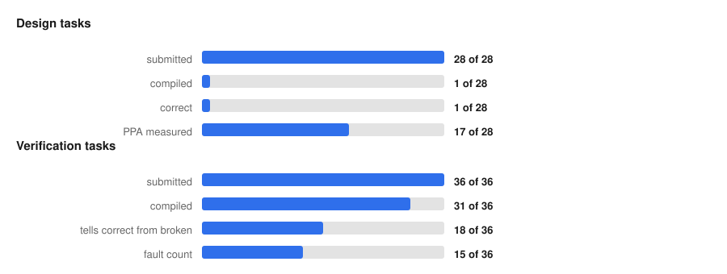

# HW-RL-Environments

A benchmark measuring whether language models can do two distinct jobs in RTL design:

1. **Design tasks**: write synthesisable SystemVerilog from a written specification, then be measured on correctness *and* on area, power and maximum frequency after a real place-and-route flow.
2. **Verification tasks**: write a self-checking testbench from a written specification, **never seeing the RTL**, then be measured on whether it accepts correct hardware and rejects faulty hardware.

The two are reported separately and never averaged. A testbench has no area; a design has no fault-detection rate. A single figure of merit would have to weight those against each other, and nothing here establishes those weights.

---

## Results at a glance

<picture>
  <source media="(prefers-color-scheme: dark)" srcset="docs/assets/funnel_dark.svg">
  
</picture>

**Most submissions do not reach a score, and they fail early.** The design half
of that chart is currently a supersession artefact rather than a result: the
design specifications were revised to state their grading criteria, so every
design submission on record answers a prompt that no longer exists and renders
as unscoreable until the tasks are re-solicited. See *Design results* below.

Of 30 verification submissions, 2 do not compile; of the 28 that build,
16 tell a correct design from a deliberately broken one, and 13 end with a
fault count. **That gate is the binding constraint on this half.** A testbench that
fails it returns the same verdict on correct and broken hardware, and every one that does so here rejects
the correct design too, so it rejects everything and its fault count carries no
information.

Where a testbench does clear the gate it usually scores near the ceiling, so the
distribution is bimodal rather than centred on a middling value. Where PPA
exists, the gap to the reference is large and not uniform: on the CDC FIFO the
submissions are 26 to 29 % smaller at the same clock, trading frequency for area,
while on the AXI crossbar the one measured submission is 14.2× the reference's
area and slower.

<picture>
  <source media="(prefers-color-scheme: dark)" srcset="docs/assets/verification_faults_dark.svg">
  
</picture>

---

## Design results

**Ten tasks have a pin and a reference built at it.** Every design specification was
revised to state its grading criteria — what correctness gates, which PPA axes
are compared, at what clock, and which levers the contract has already spent —
and every candidate was re-solicited against the revised prompt.

Each task is built at **one pinned period**, stated in the spec before
solicitation and derived as `ceil(1.5 × converged_period_ns / 0.25) × 0.25` from
the reference's own Fmax sweep. A single clock for every submission is what makes
area comparable at all: without it, area can be bought by relaxing timing.

<picture>
  <source media="(prefers-color-scheme: dark)" srcset="docs/assets/design_area_dark.svg">
  
</picture>

<picture>
  <source media="(prefers-color-scheme: dark)" srcset="docs/assets/design_power_dark.svg">
  
</picture>

**Power does not track area.** d_dsp02's `claude` is the clearest case: within
2% of the reference's area at **1.02×**, and **0.29× its power**. d_ca01's
`claude` runs the other way — 1.32× the area and **4.29× the power**. A single
figure of merit would have to weight these against each other, and nothing here
establishes that weighting, which is why there is no combined score.

<picture>
  <source media="(prefers-color-scheme: dark)" srcset="docs/assets/design_capability_dark.svg">
  
</picture>

**Raw area credits a design for being small when it was merely doing less**, and
this chart is where that shows. Two conclusions from the area chart invert:

- d_ca01's `claude` is 1.32× on raw area and **1.53×** per unit of outstanding
  capacity. The gap widens under normalisation: part of the area it saved was
  bought by tracking fewer outstanding misses.
- d_nw01's `chat` is 1.17× on area and **1.03×–5.87×** per unit delivered, and
  *how much* further behind depends entirely on which unit — 1.03× per burst,
  1.04× per disjoint pair either way, and **5.87×** per outstanding transaction
  on either master. The declared metrics disagree by a factor of **5.7** about
  the same submission, which is the strongest argument on this page against
  picking one and calling it the capability. `claude` spans 0.82×–0.86× on the
  same five metrics, so per-unit separates the two submissions where raw area —
  1.17× against 1.23× — puts them the wrong way round.
- d_ca04's three narrow from 0.73–0.74× to 0.89–0.90×. Most of that headline gap
  is two spill registers the reference has and they do not.

**Where a task declares several capability metrics, the bar spans best to worst
rather than picking one.** d_nw01 declares four, and they disagree by 31% about
how much `chat` paid per unit. Picking one and labelling it made the choice
visible but still made it silently: a reader had no way to know a different
declared metric moves the number by a third. The three other tasks declare one
metric each and render as points.

The alternatives were worse. A geometric mean is a synthetic quantity no contract
defines, and would smuggle in the combined score this project refuses. Worst-case
only penalises a task for declaring *more* metrics, which is backwards —
declaring more is better spec hygiene. One row per metric lets a four-metric task
visually outweigh a one-metric task.

Only tasks that **declare** a capability metric appear. d_dsp02 and d_ca03
declare none, so they are absent rather than shown against an invented axis —
"more is better and area buys it" is a claim about the contract, not something to
infer from a metric's name.

**Sixteen of thirty submissions produce a comparable area number.** Five missed
timing, five fail correctness, and four were rejected by the synthesis frontend
without ever running. Every pinned task now has a reference and at least one
candidate built at its pin; nothing is waiting on a build and nothing is
withheld.

<!-- BEGIN GENERATED: design-tables -->

### d_ai01 — FP16 weight-broadcast multiply-accumulate array, pinned at 16.75 ns

| | area µm² | power mW | slack ns | vs reference |
|---|---|---|---|---|
| reference | 708,442 | 278.0 | +2.368 | — |
| `chat` | **0** | **0** | — | fails correctness |
| `claude` | **0** | **0** | — | did not build |
| `gemini` | **0** | **0** | — | fails correctness |

### d_ai04 — SDP requantise / convert unit, pinned at 33.75 ns

| | area µm² | power mW | slack ns | vs reference |
|---|---|---|---|---|
| reference | 179,943 | 230.0 | +1.912 | — |
| `chat` | 174,421 | 230.0 | +2.743 | **0.97×** |
| `claude` | 158,486 | 181.0 | +5.886 | **0.88×** |
| `gemini` | 179,212 | 257.0 | +2.435 | **1.00×** |

*Choice-role metrics where a submission differs from the reference — disclosed, not penalised (G5): `gemini` buffer_slots = 4 against the reference's 2.*

### d_ca01 — non-blocking data cache, pinned at 15 ns

| | area µm² | power mW | slack ns | vs reference |
|---|---|---|---|---|
| reference | 573,055 | 76.0 | +2.200 | — |
| `chat` | *withheld* | *withheld* | **−0.049** | missed timing |
| `claude` | 753,599 | 326.0 | +2.354 | **1.32×** |
| `gemini` | **0** | **0** | — | did not build |

*Choice-role metrics where a submission differs from the reference — disclosed, not penalised (G5): `chat` latency_min = 3 against the reference's 1; `chat` mem_txns_writebacks = 481 against the reference's 487; `claude` mem_txns_writebacks = 488 against the reference's 487.*

`claude` is 1.32× the reference's area and **4.29× its power** — the widest
divergence between the two axes anywhere in these results. `chat` misses the pin
by 49 ps and is withheld.

### d_ca03 — RISC-V Sv39 MMU, pinned at 12.5 ns

| | area µm² | power mW | slack ns | vs reference |
|---|---|---|---|---|
| reference | 279,456 | 32.6 | +0.989 | — |
| `chat` | *withheld* | *withheld* | **−35.461** | missed timing |
| `claude` | 212,774 | 33.4 | +0.980 | **0.76×** |
| `gemini` | **0** | **0** | — | did not build |

`claude` is **0.76×** the reference's area raw and **0.65×** per unit of
throughput — the only submission on this page that improves in the *same*
direction on both. It delivers 192 requests per 1000 cycles against the
reference's 163 while using a quarter less area, so normalisation widens its
lead rather than narrowing it. The contrast with d_ca04 is the point: there, per
unit closed most of the raw gap.

A caution on reading it: the same submission looks *worse* per TLB hit
(0.84× against 0.76× raw), because it retains fewer entries. That axis is not
scored — P2 pins translation storage at 16+16 fully associative, so hit rate is
not a design choice and area-per-hit divides by a constant. Throughput is the
axis the design is free on, and it is the one shown.

`chat` is correct — it passes the scored configuration — and needs roughly 48 ns
to do it, against a 12.5 ns pin. That is not a near miss like d_nw03's 78 ps; it
is a design that works and is nearly four times too slow.

`gemini` is a distinct outcome from a correctness failure: slang rejects it with
ten diagnostics, none of them internal errors, and Verilator rejects the same
construct at the same line. Two independent frontends agreeing makes it a
genuine build failure rather than a host problem.

### d_ca04 — asynchronous CDC FIFO, pinned at 4.25 ns

| | area µm² | power mW | slack ns | vs reference |
|---|---|---|---|---|
| reference | 19,837 | 13.4 | +0.606 | — |
| `chat` | 14,659 | 7.3 | +0.581 | **0.74×** |
| `claude` | 14,520 | 8.2 | +0.479 | **0.73×** |
| `gemini` | 14,520 | 8.5 | +0.489 | **0.73×** |

*Choice-role metrics where a submission differs from the reference — disclosed, not penalised (G5): `chat` crossing_latency_rdclk_min = 2 against the reference's 3; `gemini` crossing_latency_rdclk_min = 2 against the reference's 3.*

The only task where every submission closed timing, and all three are 26–27%
smaller than the reference. Two of them reach that partly by a design choice
rather than better implementation — see the like-for-like note below.

### d_ca05 — Multi-requester cache miss handler, pinned at 8.75 ns

| | area µm² | power mW | slack ns | vs reference |
|---|---|---|---|---|
| reference | 141,187 | 40.6 | +0.720 | — |
| `chat` | 104,439 | 25.2 | +1.164 | **0.74×** |
| `claude` | 94,373 | 21.1 | +1.303 | **0.67×** |
| `gemini` | **0** | **0** | — | did not build |

*Choice-role metrics where a submission differs from the reference — disclosed, not penalised (G5): `chat` total_cycles = 3446 against the reference's 3947; `claude` total_cycles = 3446 against the reference's 3947.*

Both buildable submissions come in well under the reference — **0.74×** and
**0.67×** — and both close the pin with more slack than it does (+1.16 and +1.30
against +0.72). The task reached a pin only after its floorplan was fixed: 3,686
IO pins would not fit the default die perimeter, and the sweep aborted at
`PPL-0024` until the pin placer was given a second vertical layer.

`gemini` is a frontend rejection rather than a correctness failure — slang
reports it addressing a struct field that does not exist on the vendored AXI
type, and `check_transport` finds no paste damage, so it is the model's output.

### d_dsp02 — FP32 fused multiply-add, pinned at 19.25 ns

| | area µm² | power mW | slack ns | vs reference |
|---|---|---|---|---|
| reference | 60,031 | 74.7 | +2.710 | — |
| `chat` | *withheld* | *withheld* | **−22.923** | missed timing |
| `claude` | 61,305 | 21.5 | +1.424 | **1.02×** |
| `gemini` | **0** | **0** | — | fails correctness |

### d_dsp03 — multi-format FMA, pinned at 70.5 ns

| | area µm² | power mW | slack ns | vs reference |
|---|---|---|---|---|
| reference | 177,557 | 91.1 | +1.995 | — |
| `chat` | 582,093 | 167.0 | +4.136 | **3.28×** |
| `claude` | 226,664 | 134.0 | +2.512 | **1.28×** |
| `gemini` | **0** | **0** | — | fails correctness |

*Choice-role metrics where a submission differs from the reference — disclosed, not penalised (G5): `chat` latency_min = 1 against the reference's 0; `gemini` latency_min = 1 against the reference's 0.*

`chat` closes the pin but at **3.28×** the reference's area — the largest
comparable submission on the page, and a reminder that closing timing and
spending area are separate axes. `claude` is at 1.28×.

### d_nw01 — AXI4 crossbar, pinned at 8 ns

| | area µm² | power mW | slack ns | vs reference |
|---|---|---|---|---|
| reference | 147,144 | 54.7 | +1.148 | — |
| `chat` | 172,662 | 49.0 | +0.451 | **1.17×** |
| `claude` | 181,174 | 49.3 | +0.009 | **1.23×** |
| `gemini` | **0** | **0** | — | fails correctness |

*Choice-role metrics where a submission differs from the reference — disclosed, not penalised (G5): `chat` read_latency_avg = 1082 against the reference's 1344; `claude` read_latency_avg = 1273 against the reference's 1344.*

Both submissions that build now close the pin, at 1.17× and 1.23×, and both draw
**0.90×** the reference's power. `claude` clears by 9 ps, which counts.

### d_nw03 — output-queued AXI-Stream switch, pinned at 4.25 ns

| | area µm² | power mW | slack ns | vs reference |
|---|---|---|---|---|
| reference | 26,340 | 10.2 | +0.337 | — |
| `chat` | *withheld* | *withheld* | **−0.184** | missed timing |
| `claude` | 26,164 | 16.9 | +0.117 | **0.99×** |
| `gemini` | *withheld* | *withheld* | **−0.266** | missed timing |

`claude` closes at **+0.117 ns** and comes in at **0.99×** the reference's area
— the only submission in this table to land under a reference. On the previous
bytes it missed by 78 ps and was withheld; the re-solicited version clears the
pin. `chat` and `gemini` still miss, and close is still missed: the numbers they
would report describe circuits that cannot run at 4.25 ns.

<!-- END GENERATED: design-tables -->

### Why some cells are withheld and others are zero

**Timing closure is a gate, not a scored axis.** Slack is bought with area, so a
design that misses timing and one that closes it are not describing the same
circuit — quoting the area of the first beside the second compares two different
questions. PPA from a build that missed its pin is withheld, not reported (rule
22).

**A correctness failure scores zero on every PPA axis, and is shown as zero**
rather than omitted (rule 19). Omitting it would make the surviving rows look
like the whole population, which is how an 8-of-18 result reads as 8 of 10.

**"Did not build" is a separate outcome from "fails correctness"**, and they are
not interchangeable: one wrote hardware the synthesis frontend rejects, the other
wrote hardware that compiles and computes the wrong answer. Both score zero;
they say different things about the model. Three submissions never ran at all.

### Not measured yet

<!-- BEGIN GENERATED: unpinned-table -->

| task | state |
|---|---|
| d_dsp01 | no scoring testbench; withdrawn |
| d_ca06 | held out of the metrics — a hand-written probe run to see how a task with no upstream anchor behaves, not part of the scored set |

<!-- END GENERATED: unpinned-table -->


`results_table.md` carries the full per-task detail — capability metrics,
per-unit normalisations, and every superseded row rendered as *not scored against
this prompt* with the hash it answered. It is generated from the run records
under `runs/`, never hand-edited, and fails loudly rather than emitting a table
with rows missing.

Two numbers from the superseded round are worth naming, because they are why the
revision happened rather than an accident of it. d_nw01's largest submission
measured 2,086,235 µm² against a 146,932 µm² reference, and d_ca01's measured
753,209 µm². Both were buffering storage the contract never asked for. The
specifications now bound that storage by clause, and separately now say what the
submission is being compared on — neither of which they did when those designs
were solicited.

### How design choices are separated from implementation quality

Area is only comparable at a shared clock, and only between designs that made the
same free choices. Each design task declares its metrics with a role:

- **fixed** the specification requires a value; deviating is a spec violation.
- **choice** the specification leaves it free and it moves PPA. Where a
  submission chose differently from the reference, the report marks the area
  ratio **not like-for-like** rather than presenting it as a quality gap.
- **capability** more is better and area buys it. Reported raw and per unit,
  because raw area credits a design for being small when it was doing less.

There is deliberately no combined score. Nothing here establishes what a beat of
FIFO capacity is worth in µm².

---

## Verification results

One table per task, four columns, in the order a testbench has to earn them.

**The first two columns are the gate, and they are separate on purpose.** Every
testbench is run against the correct DUT and against one with every output tied
high. It must *accept* the first and *reject* the second. These were one merged
column, which rendered two opposite failures identically: a testbench that
accepts both is not observing the design at all, while one that rejects the
golden is rejecting correct hardware. Both printed "no". Splitting them matters
because rejecting the golden is the single most common failure in this round —
several submissions do it while still killing every mutant they are shown.

A testbench that fails the gate has its fault count **withheld** rather than
printed, because a count from a testbench that cannot tell correct hardware from
broken carries no information. A file that drives nothing and prints `PASS`
scores 0 here.

The ceiling is what each task's own reference testbench achieves, which proves
every seeded fault is findable.

<!-- BEGIN GENERATED: verification-tables -->

### v_ai02: byte-stream realignment (ceiling 10/10)

| Submission | Accepts golden DUT | Rejects broken DUT | Accepts other correct designs | Faults caught |
|---|---|---|---|---|
| ChatGPT 5.6 Sol | yes | yes | 1/1 | **2/10** |
| Opus 5 High | yes | yes | 1/1 | **4/10** |
| Gemini 3.1 Pro Extended thinking | yes | yes | 1/1 | **2/10** |

### v_ca03: AXI ID-width converter (ceiling 11/11)

| Submission | Accepts golden DUT | Rejects broken DUT | Accepts other correct designs | Faults caught |
|---|---|---|---|---|
| ChatGPT 5.6 Sol | **no** | yes | 0/5 | *withheld* |
| Opus 5 High | **no** | yes | 1/5 | *withheld* |
| Gemini 3.1 Pro Extended thinking | *not scored against this prompt* | — | — | *last run answered task text `18b1288587d371a8`* |

### v_ca04: stream crossbar (ceiling 10/10)

| Submission | Accepts golden DUT | Rejects broken DUT | Accepts other correct designs | Faults caught |
|---|---|---|---|---|
| ChatGPT 5.6 Sol | yes | yes | 1/1 | **6/10** |
| Opus 5 High | yes | yes | 1/1 | **8/10** |
| Gemini 3.1 Pro Extended thinking | **no** | yes | 0/1 | *withheld* |

### v_ca05: tag tracker (out-of-order queue) (ceiling 10/10)

| Submission | Accepts golden DUT | Rejects broken DUT | Accepts other correct designs | Faults caught |
|---|---|---|---|---|
| ChatGPT 5.6 Sol | yes | yes | 4/4 | **6/10** |
| Opus 5 High | yes | yes | 4/4 | **6/10** |
| Gemini 3.1 Pro Extended thinking | yes | yes | 3/4 | *withheld* |

### v_ca06: AXI data-width downsizer (ceiling 12/12)

| Submission | Accepts golden DUT | Rejects broken DUT | Accepts other correct designs | Faults caught |
|---|---|---|---|---|
| ChatGPT 5.6 Sol | — | yes | 0/5 | *withheld* |
| Opus 5 High | **no** | yes | 0/5 | *withheld* |
| Gemini 3.1 Pro Extended thinking | **did not compile** | n/a | n/a | n/a |

### v_ca07: Glitch-free integer clock divider (ceiling 10/10)

| Submission | Accepts golden DUT | Rejects broken DUT | Accepts other correct designs | Faults caught |
|---|---|---|---|---|
| ChatGPT 5.6 Sol | yes | yes | 5/5 | **6/10** |
| Opus 5 High | **no** | yes | 0/5 | *withheld* |
| Gemini 3.1 Pro Extended thinking | yes | yes | 3/5 | *withheld* |

### v_dsp02: FP non-computational ops (ceiling 13/13)

| Submission | Accepts golden DUT | Rejects broken DUT | Accepts other correct designs | Faults caught |
|---|---|---|---|---|
| ChatGPT 5.6 Sol | **no** | yes | 0/5 | *withheld* |
| Opus 5 High | yes | yes | 5/5 | **12/13** |
| Gemini 3.1 Pro Extended thinking | **no** | yes | 1/5 | *withheld* |

### v_nw01: arp engine (ceiling 10/10)

| Submission | Accepts golden DUT | Rejects broken DUT | Accepts other correct designs | Faults caught |
|---|---|---|---|---|
| ChatGPT 5.6 Sol | **no** | yes | 1/1 | *withheld* |
| Opus 5 High | **no** | yes | 1/1 | *withheld* |
| Gemini 3.1 Pro Extended thinking | **no** | yes | 0/1 | *withheld* |

### v_nw02: AXI atomic-op filter (ceiling 11/11)

| Submission | Accepts golden DUT | Rejects broken DUT | Accepts other correct designs | Faults caught |
|---|---|---|---|---|
| ChatGPT 5.6 Sol | **no** | yes | 0/1 | *withheld* |
| Opus 5 High | yes | yes | 1/1 | **10/10** |
| Gemini 3.1 Pro Extended thinking | **no** | yes | 0/1 | *withheld* |

### v_nw03: frame-arbitrating stream mux (ceiling 10/10)

| Submission | Accepts golden DUT | Rejects broken DUT | Accepts other correct designs | Faults caught |
|---|---|---|---|---|
| ChatGPT 5.6 Sol | yes | yes | 5/5 | **8/10** |
| Opus 5 High | yes | yes | 5/5 | **9/10** |
| Gemini 3.1 Pro Extended thinking | **no** | yes | 0/5 | *withheld* |

### v_nw04: PTP time base (ceiling 10/10)

| Submission | Accepts golden DUT | Rejects broken DUT | Accepts other correct designs | Faults caught |
|---|---|---|---|---|
| ChatGPT 5.6 Sol | yes | yes | 0/1 | *withheld* |
| Opus 5 High | yes | yes | 1/1 | **8/10** |
| Gemini 3.1 Pro Extended thinking | **no** | yes | 0/1 | *withheld* |

<!-- END GENERATED: verification-tables -->

## The tasks, and where this hardware is used

Reference for the results above. Thirteen tasks across three domains, every one anchored on a real, widely deployed open-source IP block rather than a toy. The reference implementation is vendored from upstream at a pinned commit, so "correct" means agreeing with hardware that people actually tape out.

### Computer architecture: the plumbing inside a CPU or SoC

| Task | Block | What it does | Where you find it | Upstream anchor |
|---|---|---|---|---|
| **d_ca04** *design* | Asynchronous CDC FIFO | Moves data between two unrelated clocks without corrupting it | Any chip with more than one clock, which is nearly all of them. The classic source of bugs that appear only in silicon | `pulp-platform/common_cells` |
| **v_ca05** *verification* | Tag tracker / ID queue | Tracks outstanding transactions so out-of-order responses can be matched to requests | Cache controllers, memory controllers, any out-of-order interconnect | `pulp-platform/common_cells` |
| **d_ca01** *design* | Non-blocking data cache | Serves hits while misses are still outstanding, instead of stalling until each fill returns | Every performance CPU. The difference between a core that stalls on every miss and one that keeps working | `bespoke-silicon-group/basejump_stl` |
| **v_ca03** *verification* | AXI ID-width converter | Remaps wide master IDs onto a narrower slave ID space without breaking ordering | Any SoC joining subsystems whose ID widths disagree, which is most of them | `pulp-platform/axi` |
| **v_ca04** *verification* | Stream crossbar | Routes N stream inputs to M outputs with per-output arbitration | On-chip switch fabric, DMA engines, any many-to-many datapath | `pulp-platform/common_cells` |

### DSP: floating-point arithmetic

| Task | Block | What it does | Where you find it | Upstream anchor |
|---|---|---|---|---|
| **d_dsp02** *design* | FP32 fused multiply-add | Computes `a×b+c` in one rounding step, one result per cycle | The core operation of every ML accelerator and GPU shader; the bulk of the silicon in a matrix engine | `pulp-platform/cvfpu` |
| **v_dsp02** *verification* | FP non-computational ops | Sign manipulation, comparison, min/max, classification: the IEEE-754 operations that move bits rather than compute | Every FPU. Individually simple, collectively full of edge cases: NaN, signed zero, subnormals | `pulp-platform/cvfpu` |
| **d_dsp03** *design* | Multi-format FMA | One multiply-add datapath serving several floating-point widths | Mixed-precision ML accelerators, where fp32 and bf16 share hardware | `pulp-platform/cvfpu` |

### Networking: on-chip interconnect

| Task | Block | What it does | Where you find it | Upstream anchor |
|---|---|---|---|---|
| **d_nw01** *design* | AXI4 crossbar | Routes transactions between several masters and several slaves, keeping AXI's ordering rules | The backbone of essentially every ARM-based SoC | `pulp-platform/axi` |
| **v_nw03** *verification* | Frame-arbitrating stream mux | Merges several AXI-Stream inputs into one without interleaving packets | NIC datapaths, video pipelines, anything moving framed data | `alexforencich/verilog-axis` |
| **d_nw03** *design* | Output-queued stream switch | Switches AXI-Stream traffic with per-output queueing | Ethernet switch fabrics, NoC routers | `alexforencich/verilog-axis` |
| **v_nw02** *verification* | AXI atomic-op filter | Strips or absorbs AXI atomic operations a downstream slave cannot handle | SoCs mixing AXI5 masters with older slaves | `pulp-platform/axi` |
| **v_nw04** *verification* | PTP time base | Maintains a fractional-nanosecond clock that can be slewed and stepped | Time-synchronised Ethernet, IEEE 1588 endpoints | `alexforencich/verilog-ethernet` |

These are deliberately not textbook exercises. They are blocks with real specifications, real edge cases, and a known-correct implementation to measure against, which is what makes a wrong answer detectable rather than a matter of taste.

---

## Repository layout

```
domains/<domain>/design/<task>/        design tasks: spec, ref, tb, mutants, orfs
domains/<domain>/verification/<task>/  verification tasks: spec, dut, dut2,
                                       conformant, mutants, probe (the prompt)
candidates/<task>/<model>.sv           submissions as received
runs/<task>/<timestamp>__<label>.json  immutable run records
refs/                                  vendored external RTL (pinned in refs.lock)
scripts/                               harness: simulation, PPA, reporting
RULES.md  FINDINGS.md  CONVENTIONS.md  methodology
results_table.md / .txt                generated report
```

## Reproducing

Requires **Verilator 5.046** and Docker for the OpenROAD flow.

Verilator is the simulator of record for every scored result. Synthesis uses **slang** inside the OpenROAD container, so a design slang rejects can never produce a PPA number, which is why some submissions are recorded as not building even though a simulator would accept them. Icarus Verilog is kept on the side as a debugging aid for awkward candidate submissions; nothing scored depends on it.

> **On formal methods:** the `openroad/orfs` image ships `sby` and `eqy` but **no SMT solver**: not yices, z3, boolector, bitwuzla, cvc5 or mathsat. The `smtbmc` engine has therefore never been runnable here. The only working engine is `abc bmc3` on the bundled `yosys-abc`, so every equivalence result in this project is **bounded**, never an unbounded proof. `refs.lock`'s toolchain line overstates this; it is frozen, and the correction is recorded in [`CONVENTIONS.md`](CONVENTIONS.md).

```bash
python3 scripts/report_table.py > results_table.md
```

```bash
bash scripts/regression.sh
```

```bash
bash scripts/sim_verification.sh domains/comp_arch/verification/v_ca05_id_queue candidates/v_ca05/chat.sv chat
```

### Automated model submissions

`runner.domain_sweep` replaces the manual prompt/chat/copy loop for every task
that has a canonical `probe/PASTE.md` and a registering `task.yaml`. It sends
that prompt to a selected model, extracts the submitted module, and dispatches
to the existing design or verification grader. Prompt-only directories retained
for withdrawn tasks, such as `d_dsp01`, are deliberately skipped.

To use included ChatGPT, Claude, or Gemini subscription quota instead of paying
for API tokens, authenticate the provider CLIs and select the subscription
transport:

```bash
codex login
claude auth login
python3 -m runner.domain_sweep --transport subscription \
  --tasks d_nw03 --models gpt-5.6-luna --smoke
```

Each subscription request runs as a fresh, non-persistent process in an empty
temporary directory, and the prompt is passed through stdin. Subscription
artifacts include `subscription` in their filenames and manifests. Codex and
Claude project/account customizations are disabled. Gemini runs headlessly in
the empty workspace; use the dedicated CLI home below so unrelated Gemini
extensions and user instructions are not loaded. The runner strips API-key and
Vertex environment variables and requires Google-account OAuth for Gemini.
Included quota is limited, so a sweep can stop until the provider's usage
window resets.

#### Gemini account setup for a collaborator

Gemini support uses the official Gemini CLI's `pro` model alias. On the
collaborator's computer, install the CLI, create a dedicated Gemini CLI home
outside this repository, and sign in interactively with the Google account that
owns the Gemini subscription:

```bash
npm install -g @google/gemini-cli@latest
export GEMINI_CLI_HOME="$HOME/.hwrl-gemini"
gemini
```

Choose **Sign in with Google** in the browser flow. Keep
`GEMINI_CLI_HOME` set to the same path when running the sweep. Gemini's
official documentation describes both [Google-account
authentication](https://github.com/google-gemini/gemini-cli/blob/main/docs/get-started/authentication.mdx)
and [`--prompt`/JSON headless
execution](https://github.com/google-gemini/gemini-cli/blob/main/docs/cli/cli-reference.md).
If the login is a company, school, or Workspace account, follow Google's guide
to set the required `GOOGLE_CLOUD_PROJECT`; the runner preserves that project
identifier while still enforcing Google-account OAuth.

After Codex, Claude, and Gemini are authenticated on that computer, all three
can participate in one resumable sweep. Five workers means at most five
task/model requests are in flight at once:

```bash
export GEMINI_CLI_HOME="$HOME/.hwrl-gemini"
python3 -m runner.domain_sweep --transport subscription \
  --tasks all --models gpt-5.6-sol,opus-5,gemini-pro \
  --api-workers 5 --smoke
```

Pushing this repository shares the Gemini integration, model roster, tests,
and instructions; it does **not** share login sessions. Codex, Claude, and
Gemini OAuth credentials remain in machine-local CLI storage and must never be
committed. On a separate computer, each account owner must complete the
corresponding CLI login there. If a collaborator is meant to use somebody
else's Codex or Claude subscription, use an account/team arrangement authorized
by that provider's terms and your organization rather than copying token or
credential files. On a shared computer and OS account, the runner uses whichever
authorized CLI sessions are already logged in locally.

For strict direct-API runs, enter keys with `read -s` to keep them out of shell
history:

```bash
read -s -p "OpenAI API key: " OPENAI_API_KEY; export OPENAI_API_KEY; echo
read -s -p "Anthropic API key: " ANTHROPIC_API_KEY; export ANTHROPIC_API_KEY; echo
```

List the checked-in provider model roster and preview a sweep without spending:

```bash
python3 -m runner.domain_sweep --list-models
python3 -m runner.domain_sweep --tasks all --models gpt-5.6-sol,opus-5 --dry-run
```

One low-cost live smoke run, with an explicit local spend stop:

```bash
python3 -m runner.domain_sweep --tasks d_nw03 --models gpt-5.6-luna \
  --smoke --max-spend 0.25
```

Every attempt gets a unique file under `candidates/<task>/`. Sanitized original
responses and a resumable manifest live under the gitignored
`results/generations/<run-id>/`; the existing graders continue to write their
immutable records under `runs/`. Add `--ppa` only when place-and-route is wanted.

> **On an Apple Silicon host, the OpenROAD flow runs amd64 under Rosetta and dies at clock-tree synthesis with "child killed: illegal instruction" unless you pass `LEC_CHECK=0`.**

## Status and limits

This is active work, and several numbers are deliberately marked *unattested* rather than published as clean:

- **Cross-design area ratios are not established.** d_ca04's reference and candidates were built at different clock periods; d_dsp02 and d_nw01 match periods but have task-text-hash gaps that block a mechanical comparability assertion.
- **Outstanding-capacity is bounded by the harness, not the design, for any design that does not saturate.** `SLV_ID_W = 4` caps the stimulus at 16 distinct AXI IDs; a design still rising in K at that point has only a lower bound, and measuring it would need a wider ID field: a change to the interface, not to the stimulus.
- **The correctness checkers verify the functional half of CDC correctness only.** Synchroniser depth and whether crossings are constrained at all need static CDC analysis or formal methods, which are not in this harness.
- **Sample sizes are small**: two to six submissions per task, one attempt each, no temperature sweep. Treat individual model rankings as anecdotes; the *distribution of failure modes* is the durable result.

## Licence and third-party code

`refs/` vendors external RTL under its own licences (SHL-0.51, Apache-2.0, MIT, BSD and ISC), pinned by SHA in [`refs.lock`](refs.lock). Those licences and their attribution requirements govern that code.

> ⚠️ **Redistribution of this repository, including sending its contents to third-party model providers, has not been legally reviewed.** Get that review before any external distribution.
